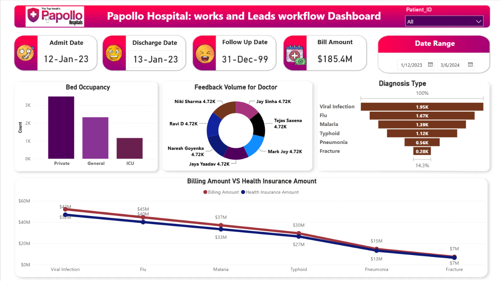

# 🏥 Papollo Healthcare Data Analytics Dashboard

An interactive **Healthcare Analytics Dashboard** built in **Power BI** to analyze hospital operations, patient trends, revenue, and departmental performance. This project demonstrates data cleaning, transformation, KPI analysis, and interactive dashboard design using Power BI.

---

## 📌 Project Overview

The dashboard provides insights into healthcare operations by analyzing:

- Patient admissions and discharge trends
- Hospital revenue and financial performance
- Doctor performance metrics
- Department-wise efficiency
- Patient demographics
- Diagnosis trends
- Healthcare KPIs for decision-making

The objective is to help hospital management monitor performance and make data-driven decisions.

---

## 🛠️ Tools & Technologies

- **Power BI**
- **Microsoft Excel**
- **Power Query**
- **DAX (Data Analysis Expressions)**

---

## 📊 Dashboard Features

- 📈 Revenue Analysis
- 🏥 Patient Admission & Discharge Analysis
- 👨‍⚕️ Doctor Performance Dashboard
- 🏢 Department-wise Performance
- 👥 Patient Demographics
- 🩺 Diagnosis Trend Analysis
- 📌 Interactive Filters & Slicers
- 📊 Key Performance Indicators (KPIs)

---

## 📈 Key Insights

- Identified high-performing hospital departments.
- Analyzed patient admission patterns across different time periods.
- Tracked overall hospital revenue and financial performance.
- Compared doctor performance using multiple KPIs.
- Visualized diagnosis trends and patient demographics for better healthcare planning.

---

## 📂 Project Structure

```
Papollo-Healthcare-Dashboard/
│
├── Dataset/
├── Dashboard.pbix
├── Dashboard Screenshots/
└── README.md
```

---

## 🚀 Skills Demonstrated

- Data Cleaning
- Data Transformation
- Data Modeling
- DAX Measures
- Power Query
- Data Visualization
- KPI Dashboard Development
- Business Intelligence
- Healthcare Analytics

---

## 📷 Dashboard Preview




## 📬 Connect With Me

**Ansh Aggarwal**

- LinkedIn: https://www.linkedin.com/in/ansh-aggarwal-2643492b4
- GitHub: https://github.com/ansh21563
- Portfolio: https://ansh-aggarwal-portfolio.netlify.app

---

⭐ If you found this project useful, consider giving it a **Star** on GitHub.